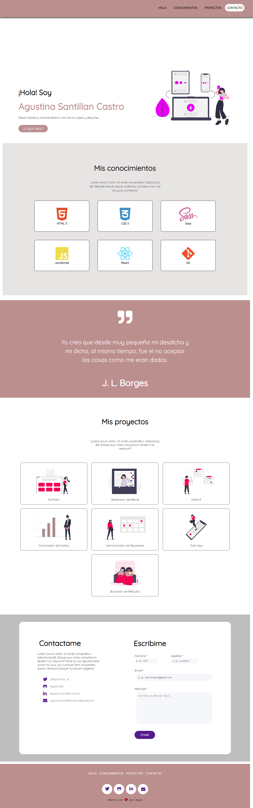

# Portfolio de Agustina

### Este proyecto fue realizado para cumplir con la entrega del modulo-01 de Ada en el curso de Frontend. Utilizando las tecnologias de **HTML** y dando los estilos con **CSS**

***

### Si te gustaria conocer mi trabajo, puedes dar click en alguno de los siguientes link:

- [Github](https://agustinasc.github.io/Proyecto/)
- [Netlify](https://upbeat-fermat-8faa3b.netlify.app/.)

<br>

### Si te gustó y queres tener el código en tu computadora, por favor, seguí estos pasos en tu terminal. 


1. Ir al [repositorio](https://github.com/agustinasc/Proyecto)
2. Darle click al botón de FORKEAR
3. Dar click al boton de code
4. Copiar la URL
5. Abrir tu terminal y poner el comando de 
```git clone <url>```
6. Entrar a la carpeta del proyecto y abrirlo en tu IDE

### Este proyecto no necesita la instalación de ninguna dependencia, por ahora!

<br>

***

### Cuando termines, tu instalación se debería ver similar a la siguiente imagen 


<br>

***

### Este portafolio fue desarrollado para demostrar que se puede aprender a desarrollar despues de los 30s y para los curios@s desarrolladores.

<br>

### Muchas gracias a JONH y a LEYDY por su paciencia y predisposición!! ❤
#### De Agus con 💜
